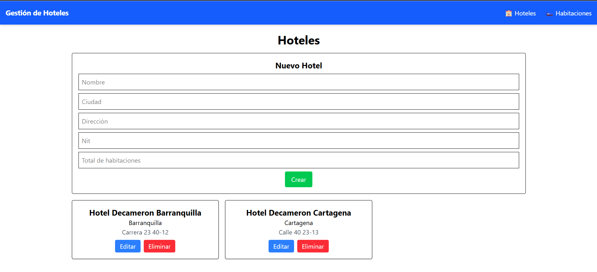

# Titulo del Proyecto

_Hotel Frontend es una aplicación desarrollada en React para la gestión eficiente de hoteles. La aplicación permite la interacción con una API REST desarrollada en Laravel para realizar operaciones de gestión como listar, agregar, actualizar y eliminar hoteles._

![Logo del Proyecto]

## Comenzando 🚀

_Estas instrucciones te permitirán obtener una copia del proyecto en funcionamiento en tu máquina local para propósitos de desarrollo y pruebas._

### Pre-requisitos 📋

_Antes de comenzar, asegúrate de tener instalados los siguientes componentes:_

- **Node.js** y **npm**:
  Asegurate de tener **Node.js** y **npm** instalados en tu sistema. Si no los tienes, instalalos desde [Node.js official website](https://nodejs.org/).

  ```sh
  node -v
  npm -v
  ```

### Instalación 🔧

1. Clona el repositorio:

   ```sh
   git clone https://github.com/joanOliveros/hotel-frontend.git
   cd hotel-frontend
   ```

2. Instala las dependencias:

   ```sh
   npm install
   ```

### Estructura de Archivos

```sh
src/
├── components/      # Componentes reutilizables.
├── pages/           # Vistas principales de la aplicación.
├── interfaces/      # Biblioteca de JavaScript React
├── services/        # Lógica para la comunicación con la API.
├── utils/           # Funciones utilitarias.
├── App.js           # Punto de entrada principal.
├── index.js         # Archivo principal para renderizar la aplicación.
```

### Uso 🔧

Una vez instaladas las dependencias, puedes iniciar el servidor de desarrollo:

```sh
npm run dev
```

Esto lanzara la aplicacion en [http://localhost:5173/](http://localhost:5173/).

### Despliegue 📦

1. Para desplegar la aplicación, asegurate de tener configurado tu entorno de producción.

Para generar los archivos de producción:

```sh
npm run build
```

### Construido con 🛠️

- **React** - Framework de JavaScript para construir interfaces de usuario

### Versionado 📌

Uso de  [Github](https://github.com/) para el versionado. Para todas las versiones disponibles, consulta los [tags en este repositorio](https://github.com/joanOliveros/hotel-frontend/tags).

### Licencia 📄

Este proyecto esta bajo ninguna Licencia MIT

### Autores ✒️

- **Joan Sebastian Oliveros Diaz** - *Trabajo Inicial* - [joanOliveros](https://github.com/joanOliveros)
